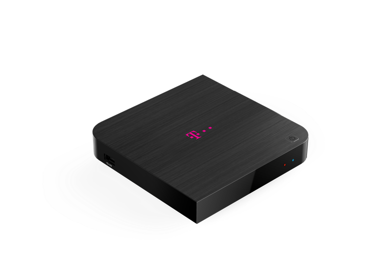
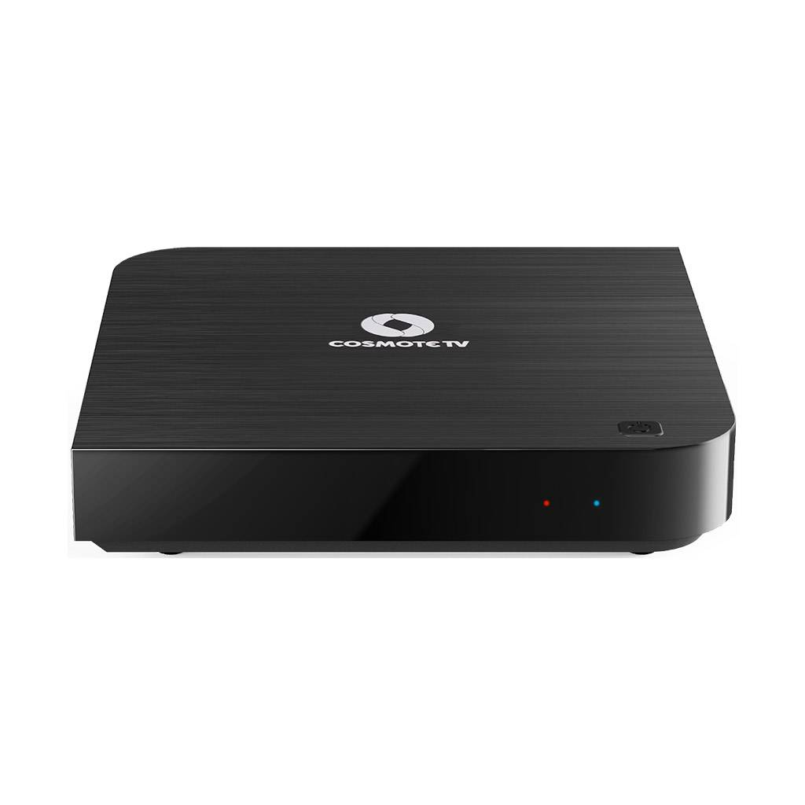

# KaonMedia KSTB6077

Reverse-engineering notes and bare-metal ARM code for the KaonMedia KSTB6077,
an Android TV set-top box built on the Broadcom BCM7268 SoC.

<p align="center">
  
  
</p>

The KSTB6077 is supplied to several TV operators, so the logo on the lid
varies by provider (Telekom and COSMOTE TV shown).

## Board

| | |
|---|---|
| Product | KaonMedia KSTB6077 (Android TV 8.0 set-top box) |
| Board name | `KM_SH368AT` (PCB silkscreen: "DT-DVB-T Android TV rev1.0") |
| SoC | Broadcom **BCM7268 B0**, chip ID `72680010` |
| CPU | 4× Broadcom Brahma-B53 (Cortex-A53, **ARMv8-A**), 1656 MHz, 1 MB L2 |
| RAM | 2 GB **LPDDR4** (one Samsung K4F6E3S4HM-MGCJ, 16 Gbit ×32) at 1856 MHz, at physical address `0x00000000` |
| Storage | 7.28 GiB eMMC: user area, two 4 MB boot partitions, 4 MB RPMB |
| Firmware | BOLT v1.34 bootloader, BSP 4.2.5, ARM Trusted Firmware BL31, PSCI v0.2 |

## What the board has

| Function | Hardware | Where |
|---|---|---|
| Serial console | UART0, 16550-compatible, 115200 8N1, at `0xf040c000`; 5-pin header on the PCB | `docs/booting.md` |
| More UARTs | UART1 `0xf040d000`, UART2 `0xf040e000`: 16550, 81 MHz clock, working (loopback-tested), unused by BOLT; pins unknown | `docs/hardware/uart.md` |
| Ethernet | GENET v5 at `0xf0480000`, internal BCM7268 PHY (ID `0xae025091`), 100 Mbit/s | `docs/bolt/bolt.md` |
| Wi-Fi | Broadcom **BCM43570** on PCIe (`14e4:aa31`, chip `0xaa32`); power switched by AON GPIO 21 and 26 | `docs/stock-firmware.md` |
| Bluetooth | Broadcom USB adapter `0a5c:2045` | |
| USB | 5 host controllers at `0xf0b00300–0xf0b01000` (2× EHCI, 2× OHCI, xHCI); one USB-A port = EHCI1/OHCI1, internal BT = EHCI0/OHCI0. Controllers are reset by `go`, PHY stays up: OHCI1 brought up from EL2, keyboard detected | `docs/hardware/usb.md` |
| Video | HDMI, driven by the Broadcom display pipeline (no open driver). BOLT's boot splash sets it up (from the `flash0.splash` partition; re-added on the modified box) and leaves a **1920 × 1080 RGB565 framebuffer** (surface register `0xf0641048`), which stays live after `go -64`; `load -splash` redraws it with any BMP. The display's register-DMA (RDC) runs a list of our own from RAM: background colour, window size and position tested | `docs/hardware/display.md` |
| 3D GPU | Broadcom V3D 3.3 at `0xf1200000` (hub) / `0xf1208000` (core), 8 QPUs, behind power island `0xf041d020`; driven from EL2: TFU job, render jobs into the framebuffer, a binner job and a shaded triangle | `docs/hardware/gpu.md` |
| 2D blitter | M2MC at `0xf09b0000`: fill, copy, scaling, 8-bit palette lookup; 320 × 200 → 1600 × 1000 onto the screen in 1.65 ms | `docs/hardware/peripherals.md` |
| Audio | HDMI, 48 kHz 32-bit stereo from a looping DRAM buffer. BOLT's splash starts it from a `pcm0` in `flash0.splash` but skips the HDMI audio clock at 1080p; three register writes (N/CTS) make it audible. Keeps running after `go -64` | `docs/hardware/audio.md` |
| Data storage | `flash0.splash` past 1 MB holds a large file that BOLT loads into RAM before `go` (~15 MB/s); now a 14.4 MB Doom WAD | `docs/hardware/storage.md` |
| TV tuner | DVB-T tuner with RF input | |
| Power LED (LED1) | green = AON GPIO 18, red = AON GPIO 17; active-low; both on = orange | `docs/hardware/gpio.md` |
| Blue LED (LED3) | AON GPIO 16, active-low | `docs/hardware/gpio.md` |
| Standby button (SW1) | AON GPIO 14, active-low | `docs/hardware/gpio.md` |
| Recovery / BT-pairing button (SW4) | AON GPIO 7, active-low; held at power-on → recovery; in Android → Bluetooth remote pairing | `docs/hardware/gpio.md` |
| Power switch (SW2) | hard power switch | |
| IR receiver (IR1) | IR receiver block channel kbd1 at `0xf0419900`; enabled as an NEC decoder from EL2, it receives all keys of the Kaon remote (custom code `0x0820`). BOLT leaves it off | `docs/hardware/ir.md` |
| Temperature sensor | AVS TMON at `0xf04d1500`, °C = (410040 − code × 487) / 1000 | `docs/hardware/system-blocks.md` |
| Seconds counter | wake timer at `0xf041a080`, 27 MHz clock | `docs/hardware/system-blocks.md` |
| Watchdog | `0xf040a6a8`, 27 MHz ticks | `docs/hardware/system-blocks.md` |
| Software reset | SUN_TOP_CTRL `0xf0404304` / `0xf0404308` | `docs/hardware/system-blocks.md` |
| Reset-surviving memory | 1 KB AON SRAM at `0xf0410200` | `docs/hardware/system-blocks.md` |
| Interrupt controller | ARM GIC-400 (GICv2) at `0xffd01000`, 256 interrupt IDs, 4 CPU interfaces, fed by Broadcom L2 controllers; all SPIs are non-secure (group 1) | `docs/hardware/interrupts.md` |
| CPU timer | ARM generic timer, 27 MHz | `docs/hardware/system-blocks.md` |
| CPU cores | 4 × Brahma-B53; `go -64` runs core 0, PSCI `CPU_ON` starts cores 1–3 at EL2 (tested) | `docs/hardware/cpu-cores.md` |

## CPU modes

- BOLT runs in 32-bit mode (AArch32 SVC, non-secure) with its MMU and caches
  on. The EL3 secure monitor (`smm64`, PSCI v0.2) lives at `0x06400000`.
- `go` starts a program in AArch32 under BOLT's MMU. Peripherals are then
  reachable only in `0xf0000000–0xf12fffff`; the GIC (`0xffd…`) is unmapped,
  and accessing it hangs the board.
- `go -64` starts a program in **AArch64 at EL2**, and `boot -64 -el3` starts
  it in **AArch64 at EL3**, as the secure monitor. Both enter with the MMU
  and caches off and no vector table, so all peripherals, including the GIC,
  are reachable at their physical addresses.

Details: `docs/booting.md`, `docs/hardware/memory-map.md`.

## Repository

| Path | Contents |
|---|---|
| `assembly/` | 32-bit bare-metal UART monitor (`boot.s`), `build.sh`, built `bootstrap.bin`/`.elf` |
| `tools/build-a64` | builds an AArch64 program (`.s` → `.elf` + `.bin`, clang + ld.lld) |
| `tools/kstb-run` | uploads a binary over the BOLT serial console, CRC-checks it, runs it (`go` / `go -64`) |
| `tools/kstb-bolt` | gets the board to `BOLT>` by sending Ctrl-C during boot (power-cycle or `--reset`) |
| `tools/kstb-dump` | dumps board memory to a file over the BOLT console (read-only) |
| `tools/make-splash` | builds a `flash0.splash` boot-splash container (GZBR/zlib) from an image, optionally with a raw `pcm0` sound (`--pcm`) |
| `tools/re/` | helpers for analysing a BOLT RAM dump: `xref.py` (string → code), `ann.py` (annotated listing), `callers.py` |
| `boot/original_dtb.dts` | BOLT's base vendor device tree |
| `boot/stock_dtb.dts` | the device tree a stock box hands to Linux (after BOLT and BSU fix-ups) |
| `boot/dtb.dtb`, `boot/Decompiled_dtb.dts` | patched device tree from the Linux port |
| `boot/sysinit.txt` | BOLT autoboot script for the USB stick |
| `docs/booting.md` | how to load and run code: USB stick, TFTP, 32/64-bit, watchdog safety net |
| `docs/stock-drivers.md` | the stock firmware's Broadcom drivers (`tools/fetch-stock`, local only) and how to read them as a guide |
| `docs/stock-firmware.md` | the untouched stock firmware: boot chain, boot reasons, how to reach BOLT, stock DTB, stock kernel facts |
| `docs/hardware/peripherals.md` | every known hardware block (DTB + BOLT), what it is, and the first word read from it |
| `docs/hardware/gpu.md` | **V3D GPU map**: blocks, reset values, control-list opcodes, what is tested and what isn't |
| `docs/hardware/registers.md` | **register sheet**: every known address on one page, what it does, what not to touch |
| `docs/hardware/` | memory map, GPIO, IR, UARTs, display, audio, storage, USB, interrupts, system blocks, device-tree provenance |
| `docs/bolt/bolt.md` | the BOLT bootloader: memory layout, page table, devices, commands by risk |
| `docs/bolt/raw/` | raw BOLT console captures, including `rescue.txt`; `stock/` holds the stock box's boot logs and BOLT session |
| `docs/ideas/second-stage-bootloader.md` | proposal: a shim between BOLT and Linux |
| `docs/history/linux-port.md` | the earlier Alpine / Linux 6.6 port |
| `docs/images/` | product photos, PCB photo, Android recovery screenshot |

## Quick start

With the board at `BOLT>` and the serial bridge running:

```
tools/build-a64 prog.s
tools/kstb-run --a64 --watchdog 20 --wait-bolt prog.bin    # AArch64 at EL2

assembly/build.sh
tools/kstb-run assembly/bootstrap.bin                      # 32-bit monitor
```

USB-stick and TFTP loading: `docs/booting.md`.
